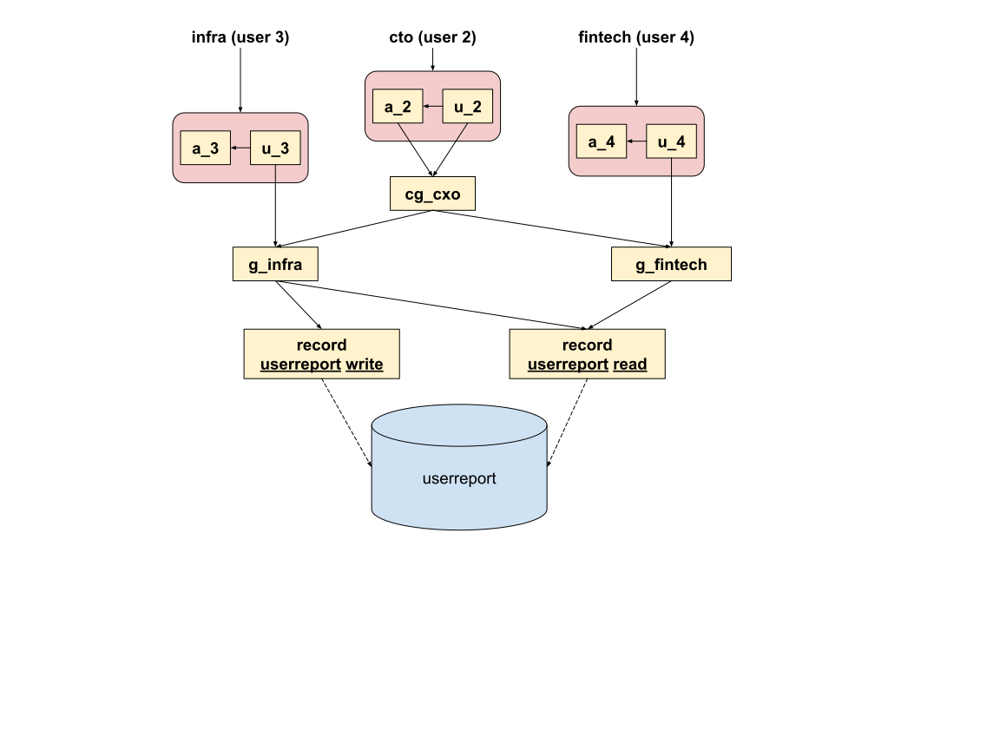

### Instructions

    $ docker-compose build && docker-compose up -d 
    $ docker-compose exec app python /app/manage.py migrate
    $ docker-compose exec app python /app/manage.py loaddata test_data.json 
    $ docker-compose exec app python /app/test_example_gogolook.py

#### Model Naming
* Role for User (u_{user_id})
* Role for Admin (a_{user_id})
* Role for Group (g_{group_name})
* Role for Record (record)
  * record
  * action
* Role for Combined Group (cg_{group_name}})

### Example 

